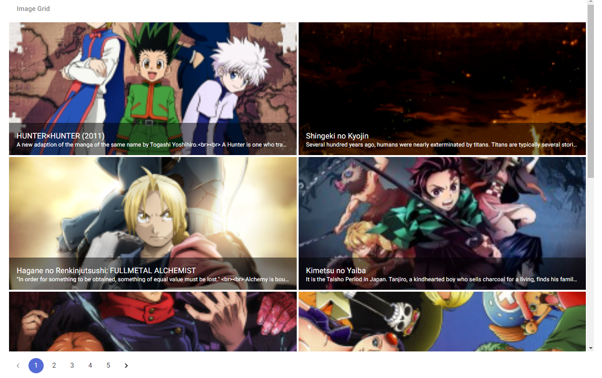

# inkwell
- Client app is created inside client folder
- Server app is created inside server folder

# Prerequisites
- Node and npm
- React, next & material-ui 
- Express

# How to run:

- For Frontend application run the below commands in sequence
    - `cd client`
    - `npm install`
    - `yarn dev or npm run dev`
        - App should build successfully and serve at http://localhost:3000

- For backend application, run the below commands in sequence
    - `cd server`
    - `npm install`
    - `yarn wach or npm watch` - Leave the teminal as it is and open up a new terminal in the same folder and type the next command
    - `yarn start or npm start`
        - Server will start and make a GET request to the following endpoint to get a response:
        http://localhost:5000/medias

# Output:
- Anime Image grid with pagination:

- Added REST API to the following endpoint(GET):
http://localhost:5000/medias

